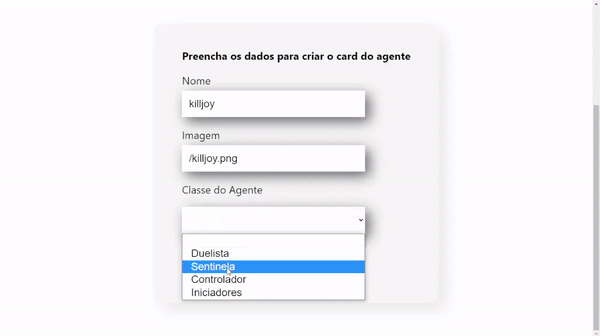

# Valorant-React


## 🔨 Funcionalidades do projeto

Projeto React de um formulario que submete informações dos agentes do FDS Valorant e cria cards referentes a sua especificação



## ✔️ Técnicas e tecnologias utilizadas

As técnicas e tecnologias utilizadas pra isso são:

- `CardView`: container para apresentar cada agente de acordo com suas caracteristicas
- `React`: Dinamismo com a aplicação desde criação dos componentes quanto funcionamento de funcões
- `Components`: Criação de componentes em JSX

## 📁 Acesso ao projeto

Você pode [acessar o código fonte do projeto inicial](https://github.com/cesarsouza13/Valorant-React) ou [baixá-lo](https://github.com/cesarsouza13/Valorant-React/archive/refs/heads/main.zip).


## 🛠️ Abrir e rodar o projeto

Após baixar o projeto, você pode abrir com o Visutal studio Code e seguir os seguintes comandos 

Inicialize o projeto com:
```
npx creacte-react-app
```
Em seguida,

```
npm start
```
